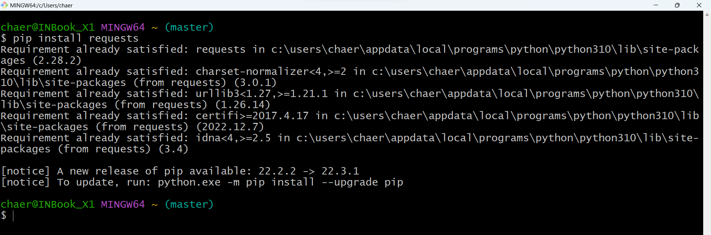
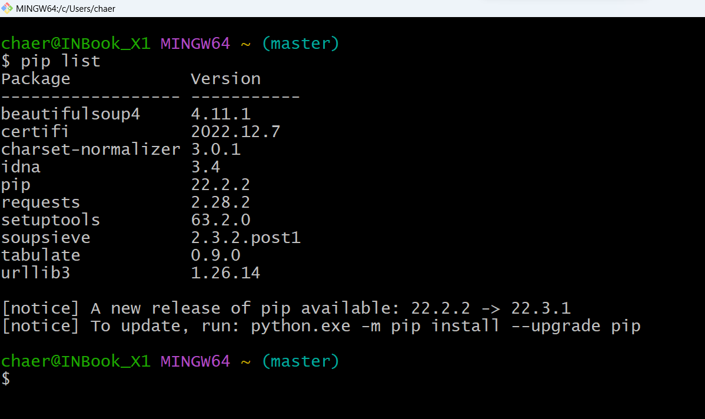
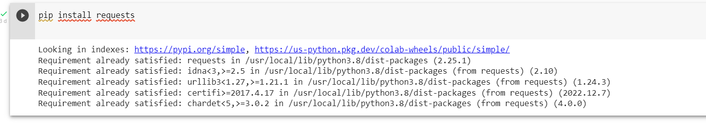
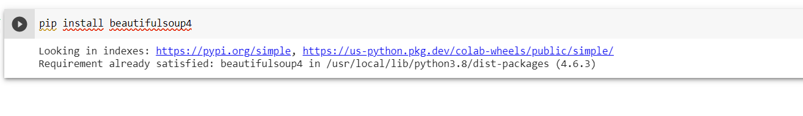
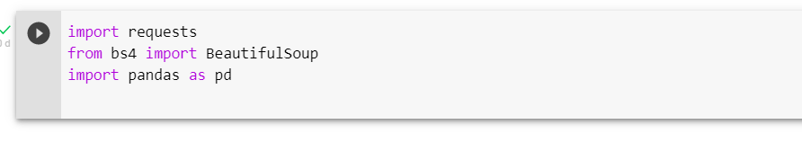
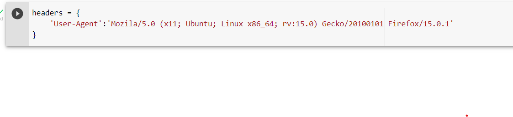
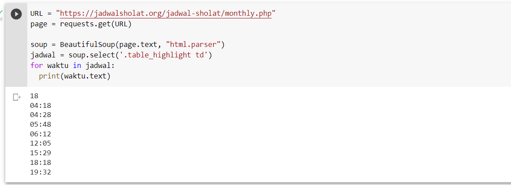
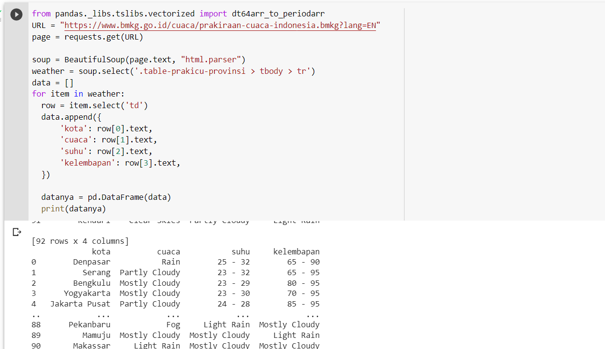
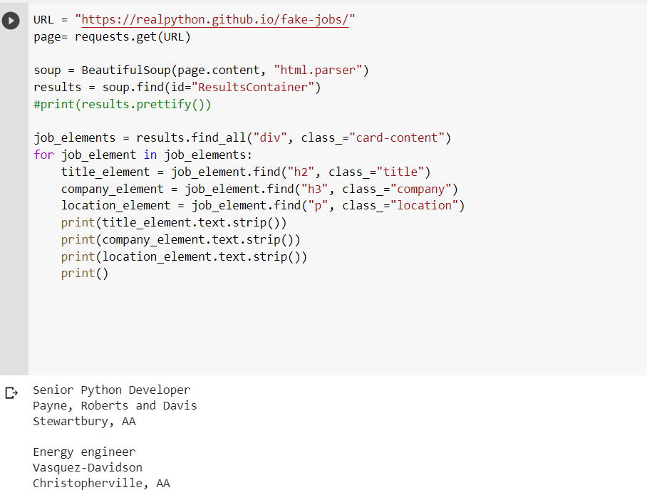
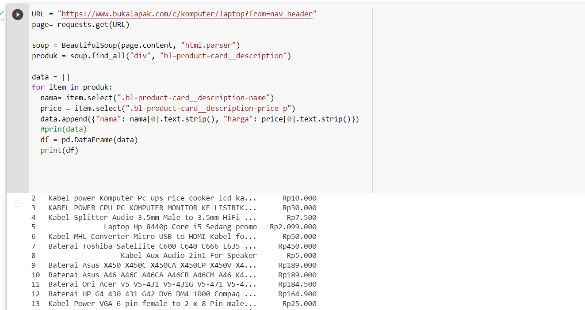

# Pratikum-Pertemuan15

## Web Scrapping
## Nama   : Chaerul Hidayat
## NIM    : 312210300
## Kelas  : TI. 22 A3

## 1. Install pip disini saya menggunakan gitbash dengan mengetik [pip install requests]()
 
## 2. Kita cek dulu apakah pip sudah terinstal dengan mengetik [pip list]()
 
## 3.Buka GoogleColab, lalu buat notebook baru dan beri nama
## 4. Saat Nya kita install library

 
## 5. Selanjutnya kita import library dan headers

 
## 6. Kita Mencoba Web Scraping Sederhana
## [1. Scraping Web Waktu Sholat]()
 
## [2. Scraping Web Prakiran Cuaca]()
 
## [3. Scraping Web Fake Jobs]()
 
## [4. Scraping Marketplace Bukalapak]()
 

